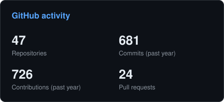
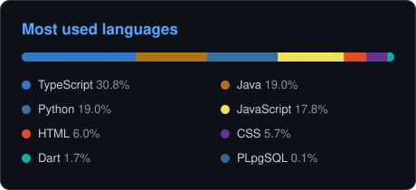

<!-- BANNER - generated by scripts/banner.py -->
<picture>
  <source media="(prefers-color-scheme: dark)"  srcset="assets/banner-dark.svg">
  <source media="(prefers-color-scheme: light)" srcset="assets/banner-light.svg">
  
</picture>

 

 

&nbsp;&nbsp;
&nbsp;&nbsp;

 

---

## about

Hi, I'm **Emilio**, a software developer from Loja, Ecuador 🇪🇨.

- 💼 Working at [MediHelp](https://medihelp.lat), adding AI workflows to healthcare software.
- 🎓 My thesis automates syllabus equivalence at Universidad Nacional de Loja with local LLMs and RAG.
- 🧠 Interested in local AI, RAG pipelines and agentic workflows, and in the web apps around them.
- 🎯 2026 goal: bringing RAG and LLMs into health tech.

## stack

Basics: C# (Unity) · C++

---

## projects

| Project | What it does | Built with |
| :--- | :--- | :--- |
| **Agente-Silabos** 🔒 | Multi-agent pipeline with local LLMs and RAG that compares university syllabi for credit transfer. My thesis project. | Python · FastAPI · n8n · PostgreSQL · Docker |
| **Horarios-27-Febrero** 🔒 | Offline-first timetable planner for a high school, with conflict checks and print-ready schedules. | Next.js · TypeScript · Supabase |
| **Nut & Bolt Vision** 🔒 | Real-time nut and bolt classification and segmentation with YOLO and TensorRT, connected to an Arduino. | Python · PyTorch · YOLO · Arduino |
| [**dual-loop-transcriber**](https://github.com/bravemilio15/dual-loop-transcriber) | Local real-time transcription of system audio and microphone, with voice detection and speaker diarization. | Python · Faster-Whisper · CUDA |
| [**becas-unl-rag**](https://github.com/bravemilio15/becas-unl-rag) | Experimental RAG console for questions about UNL scholarship rules, with hybrid search and model fallback. | Python · FastAPI · ChromaDB |
| [**dashboard-fiscal-loja**](https://github.com/bravemilio15/dashboard-fiscal-loja) | Dashboard of Loja's tax collection (2020–2024) with anomaly detection, clustering and forecasting. | Python · Streamlit · Plotly |

🔒 Private repository

---

## activity

<!-- Generated by scripts/cards.py, refreshed daily by .github/workflows/profile.yml -->
<picture>
  <source media="(prefers-color-scheme: dark)"  srcset="assets/stats-dark.svg">
  <source media="(prefers-color-scheme: light)" srcset="assets/stats-light.svg">
  
</picture>
<picture>
  <source media="(prefers-color-scheme: dark)"  srcset="assets/languages-dark.svg">
  <source media="(prefers-color-scheme: light)" srcset="assets/languages-light.svg">
  
</picture>

  

<picture>
  <source media="(prefers-color-scheme: dark)"  srcset="https://raw.githubusercontent.com/bravemilio15/bravemilio15/output/github-contribution-grid-snake-dark.svg">
  <source media="(prefers-color-scheme: light)" srcset="https://raw.githubusercontent.com/bravemilio15/bravemilio15/output/github-contribution-grid-snake.svg">
  
</picture>

